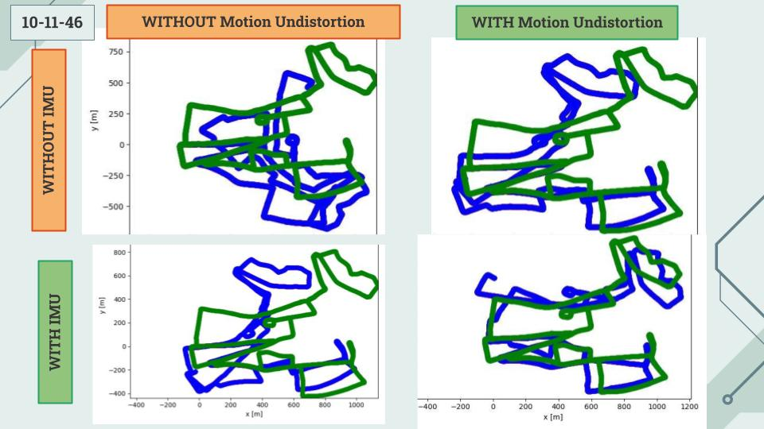
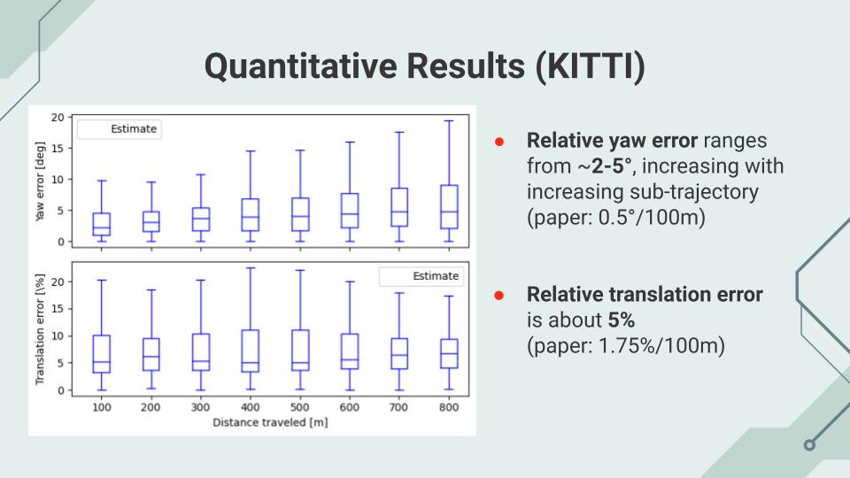

# CFEAR

C++ Implementation of [CFEAR paper](https://arxiv.org/pdf/2105.01457.pdf). There is an added component where ground truth yaw values are used to propagate rotational velocity. This simulates the presence of an IMU, and was added as an attempt to improve the [results](#results). However, I am still unable to replicate the results of the original paper.

- [CFEAR](#cfear)
  - [Results](#results)
  - [Requirements](#requirements)
  - [Build](#build)
    - [Linux](#linux)
    - [Windows](#windows)
  - [Data Reformatting](#data-reformatting)
    - [Radar Image Format](#radar-image-format)
  - [Universal Run Script](#universal-run-script)
    - [Target Names](#target-names)
  - [Benchmarking](#benchmarking)
  - [Code Documentation](#code-documentation)
  - [Other Resources](#other-resources)
    - [Robot Car SDK (Viewing Toolkit)](#robot-car-sdk-viewing-toolkit)

## Results

Result on sequence 10-11-46 of [Oxford Radar RobotCar Dataset](https://oxford-robotics-institute.github.io/radar-robotcar-dataset/datasets), comparing outputs with and without motion undistortion/fake IMU.



It is noted that I am unable to reproduce the results presented in the paper. The relative translation and yaw based on the KITTI benchmarking process (see [below](#benchmarking)) for the best result (with fake IMU and motion undistortion) is shown below:



## Requirements

C++ >= C++17
CMake >= 3.2
OpenCV >= 3.4.11
Eigen3 >= 3.3.7
Ceres >= 2.2

Python >= 3.6

*For Python dependencies, see `./plotter/requirements.txt`. You can install these dependencies using `pip install -r ./plotter/requirements.txt`*

## Build

### Linux

To build, simply run the `./scripts/build.sh` bash script. Note that this will enforce a FRESH build. In other words, it will delete the existing build directory and rebuild the entire project from scratch. If you want to build only what has changed instead, use the `./compile.sh` file.

If needed, set the `OpenCV_DIR` variable that points to your OpenCV directory in your `.bashrc` or `.bash_profile` file, and re-run the build script.

### Windows

If possible, you might be able to run the bash script via Powershell. Otherwise, manually create a `./build` folder, `cd` into it, and run `cmake ..` via the command line or use the CMake GUI. Then, to compile all the [related subprograms](#universal-run-script), run `cmake --build .`.

## Data Reformatting

Data is taken from the [Oxford Radar RobotCar Dataset](https://oxford-robotics-institute.github.io/radar-robotcar-dataset/datasets).

Data is being reformatted as:

```bash
data
 |
 |---0
    |---gt
          |---radar_odometry.csv
    |---radar
          |---<img_1>.jpg
              
               ...
               
          |---<img_n>.jpg
    | radar.timestamps
 |
 |---1
    ...
```

### Radar Image Format

Each image is 3779 x 40 (range x angle). Angle resolution is 0.9 degrees. Range 0 to 163m, resolution of 4.38cm.
The raw radar image also contains 11 columns of metadata such as timestamps and azimuths, handled by the algorithm.

More info [here](https://oxford-robotics-institute.github.io/radar-robotcar-dataset/documentation).

## Universal Run Script

There are many subprograms that are built and are available for use. To run them, there is a universal run script that can be used as follows:

```bash
./scripts/run.sh [DATASET_ID=0 [TARGET="main" [START_IND=0 [END_IND=-1]]]]
```

- `DATASET_ID`: ID of dataset as integer, as formatted in [Data Formatting](#data-formatting) section above.
- `TARGET`: Type of sub-program to run, as string (see full list [below](#target-names))
- `START_IND`: Index of starting frame (might not be used, depends on `TARGET`)
- `END_IND`: Index of ending frame (might not be used, depends on `TARGET`). `-1` implies run to completion.

### Target Names

Below is the full list of possible subprograms to run.

| `TARGET` String     | Description                                                 | C++/Python Executable |
|--------------------:|:-----------:|:-----------|
| `cfear`, `main`, `feed` | Main program. Generates visualization of predicted and ground truth poses in `./results/<DATASET_ID>/poses/poses_<START_IND>_<END_IND>.jpg`. Benchmarking will be performed if full sequence is run. Raw pose information found in `./results/<DATASET_ID>/poses/poses_<START_IND>_<END_IND>.txt`. | `./build/RunCFEAR <DATASET_ID> <START_IND> <END_IND>` |
| `benchmark` | Run benchmarking using [rpg-evaluator](https://github.com/uzh-rpg/rpg_trajectory_evaluation). Must be done AFTER main program is run. NOTE: Currently only allows for benchmarking on full sequence. More details [below](#benchmarking). | `./scripts/startBenchmark.sh` |
| `radar`, `video`, `filter` | Visualization of filtering and oriented surface points, with video generation. Images generated in `./results/<DATASET_ID>` folder as `<FRAME_NUM>.jpg`. MP4 video generated as `results_<START_IND>_<END_IND>.mp4` (requires FFMPEG). | `./build/TestRadar <DATASET_ID> <FRAME_NO> 1` |
| `gt`, `groundtruth`, `procgt` | Converts ground truth information from relative to absolute pose information. Needs to be run for main program to visualize GT poses properly. Output at `./results/<DATASET_ID>/poses/gt.txt` | `./build/ProcessGroundTruth <DATASET_ID>` |
| `kitti` | Converts absolute poses into KITTI format for benchmarking. Output at `./results/<DATASET_ID>/poses/poses_kitti_<START_IND>_<END_IND>.txt`. To force it to convert ground truth data, set `START_IND` as `-1`. | `./build/PosesToKITTI <DATASET_ID> <START_IND> <END_IND>` |
| `plotter` | Plots predicted and ground truth poses generated by the `main` subprogram. Requires Python. | `python plotter/parsePoses.py <DATASET_ID> <START_IND> <END_IND>` |


## Benchmarking

Benchmarking is performed using the [RPG Evaluator](https://github.com/uzh-rpg/rpg_trajectory_evaluation), which uses the [KITTI odometry benchmark](http://www.cvlibs.net/datasets/kitti/eval_odometry.php). I am currently using a [forked repository](https://github.com/Samleo8/rpg_trajectory_evaluation) with changes to the code to resolve errors and alter the default parameters.

By running `./scripts/run.sh <DATASET_ID> benchmark`, you will be able to benchmark the results of the main program, with subtrajectories of (100, 200, 300, ..., 800) meters. The evaluator will then output raw absolute and relative error information into `./results/<DATASET_ID>/poses/saved_results` folder. Box-plot and graphical visualizations are saved in the `./results/<DATASET_ID>/poses/plots` folder, which are easier to parse. Note that for 2D data, the roll, pitch and scale information is irrelevant.

## Code Documentation

Doxygen docs can be found at `./docs/doxygen/html/index.html`. You can regenerate them using the `./doxygen` command.

## Other Resources

### Robot Car SDK (Viewing Toolkit)

I modified the [original robot car SDK toolkit](https://github.com/ori-mrg/robotcar-dataset-sdk) to support pausing, playing, stepping through etc. ~~It is included as a submodule repo under `robotcar-dataset-sdk`.~~

To play the radar feed, clone my git repo then run the internal script.

```bash
git clone git@github.com:Samleo8/robotcar-dataset-sdk.git
./robotcar-dataset-sdk/playRadar
```

Note that you will require Python >= 3.4 to run it.